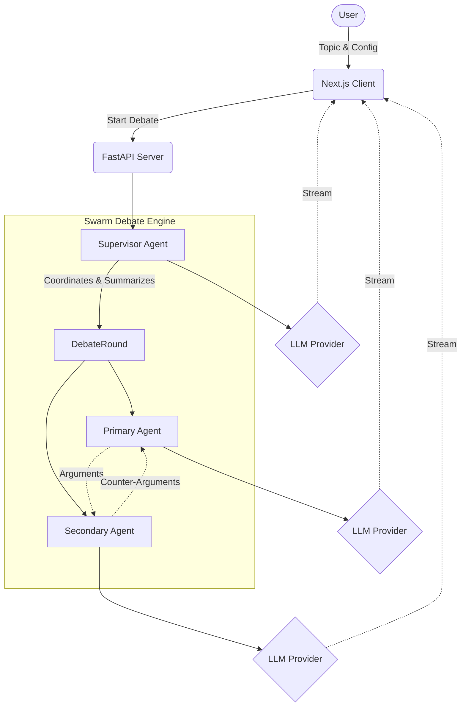

<div align="center">
  
  &nbsp;
  
  &nbsp;
  
  
  <br />
  <br />
  
  <h1>🌟 TechHubAI</h1>
  <h3>The Next-Generation Multi-Agent Swarm Debate Engine</h3>
  
  <p>
    <strong>Observe complex, AI-driven debates orchestrated by multiple independent LLM agents in a visually stunning, real-time interactive environment.</strong>
  </p>
  
  <p>
    <a href="#-features">Features</a> •
    <a href="#-the-swarm-architecture">Architecture</a> •
    <a href="#-getting-started">Getting Started</a> •
    <a href="#-ui-design-philosophy">UI Philosophy</a> •
    <a href="SETUP.md">Detailed Setup</a>
  </p>

  <p>
    <a href="https://github.com/yourusername/TechHubAI/stargazers"></a>
    <a href="https://github.com/yourusername/TechHubAI/network/members"></a>
    <a href="https://github.com/yourusername/TechHubAI/issues"></a>
    <a href="https://opensource.org/licenses/MIT"></a>
  </p>
</div>

---

## 📖 Overview

**TechHubAI** is a platform built to explore cognitive synergy between Large Language Models (LLMs). Rather than asking a single model for an answer, TechHubAI sets up a **Swarm Debate**. You define the topic, the models, and their respective personas, and watch as they debate the issue, critique each other's points, and are ultimately guided by a Supervisor agent towards a comprehensive conclusion.

Whether you are evaluating model reasoning capabilities, researching complex topics, or just want to see how Mistral argues with GPT-4, TechHubAI provides the perfect arena.

---

## ✨ Core Features

<table>
  <tr>
    <td width="50%">
      <h3>🧠 Multi-Agent Swarm</h3>
      Watch independent AI agents (Primary, Secondary, and Supervisor) interact, debate, and summarize complex topics. Each agent is aware of the context and the preceding arguments.
    </td>
    <td width="50%">
      <h3>🎨 Premium Claymorphic UI</h3>
      A stunning, animated 3D interface that breaks away from traditional flat web design. Built with Framer Motion and custom CSS, it feels tactile, responsive, and alive.
    </td>
  </tr>
  <tr>
    <td width="50%">
      <h3>🔄 Intelligent Model Fallback</h3>
      Never drop a debate due to API rate limits (429s). The engine features a robust, automatic fallback mechanism that cascades down to smaller models or alternative providers instantly.
    </td>
    <td width="50%">
      <h3>🔌 Multi-Provider Support</h3>
      Bring your own API keys for seamless integration with: <strong>OpenAI</strong>, <strong>Anthropic</strong>, <strong>Google (Gemini)</strong>, <strong>Groq</strong>, <strong>Mistral</strong>, and local models via <strong>Ollama</strong>.
    </td>
  </tr>
  <tr>
    <td width="50%">
      <h3>🌊 Real-time Streaming</h3>
      No waiting for long responses. The platform uses Server-Sent Events (SSE) to stream the debate token-by-token directly to the UI for an immersive experience.
    </td>
    <td width="50%">
      <h3>🛠️ Highly Configurable</h3>
      Adjust agent personas, debate topics, model selection, temperature, and fallback behaviors entirely from the frontend UI before launching the debate.
    </td>
  </tr>
</table>

---

## 🏗️ The Swarm Architecture

The core of TechHubAI is its Swarm Engine. It operates on a hierarchical multi-agent framework:



### 🔁 The Fallback Cascade

Our intelligent token rate-limiter catches `429 Too Many Requests` errors and immediately retries the prompt using a predefined cascade:
1. **User Fallback**: The specific fallback model selected in the UI settings.
2. **Internal Cascade**: Smaller, faster models from the same provider (e.g., `gpt-4o` -> `gpt-3.5-turbo`).
3. **Cross-Provider**: If the primary provider is completely exhausted, the system falls back to secondary providers configured in the `.env` file (e.g., failing over from Anthropic to Mistral).

---

## 🎨 UI Design Philosophy

TechHubAI utilizes **Claymorphism**, a modern UI trend that combines:
- Soft, pillowy 3D shapes.
- Inner shadows and highlights for a tactile feel.
- A four-point artificial "studio lighting" system implemented purely in CSS.
- Fluid, physics-based micro-interactions powered by Framer Motion.

The goal is to make the AI agents feel like physical entities operating within an interactive digital arena, moving away from the standard "chat bubble" interface.

---

## 🛠️ Technology Stack

### Frontend
- **Framework**: Next.js 14 (App Router)
- **Language**: TypeScript / React
- **Styling**: Tailwind CSS + Custom CSS Modules
- **Animations**: Framer Motion
- **Icons**: Lucide React

### Backend
- **Framework**: FastAPI (Python 3.10+)
- **Concurrency**: Uvicorn, asyncio
- **LLM Clients**: `openai`, `anthropic`, `google-genai`, `groq`, `mistralai`
- **Streaming**: `sse_starlette`

---

## 🚀 Getting Started

Setting up TechHubAI locally is designed to be straightforward.

For full, step-by-step instructions across **macOS**, **Windows**, and **Linux**, please refer to our dedicated setup guide:

### 👉 [Read the Comprehensive SETUP.md](SETUP.md)

### Quick Start Preview

1. **Clone the repo**
   ```bash
   git clone https://github.com/yourusername/TechHubAI.git
   cd TechHubAI
   ```
2. **Setup the Backend** (Create a virtual environment and install requirements)
   ```bash
   python -m venv venv
   source venv/bin/activate  # On Windows use: venv\Scripts\activate
   pip install -r requirements.txt
   ```
3. **Configure Environment** (Create a `.env` file and add your API keys)
   ```env
   OPENAI_API_KEY=sk-...
   MISTRAL_API_KEY=...
   ```
4. **Run the Backend**
   ```bash
   python server.py
   ```
5. **Run the Frontend** (In a new terminal)
   ```bash
   cd frontend
   npm install
   npm run dev
   ```
6. **Access the App**: Navigate to `http://localhost:3000`

---

## 🗺️ Roadmap

- [x] Initial Swarm Engine (Primary, Secondary, Supervisor)
- [x] Multi-Provider Integration (OpenAI, Anthropic, Groq, Google)
- [x] Mistral Support & Model Fallback System
- [x] Real-time SSE Streaming
- [x] Claymorphic 3D UI
- [ ] Implement Memory/Context retention across sessions
- [ ] Export debate transcripts as PDF/Markdown
- [ ] Add support for custom local models via vLLM / LM Studio

---

## 🤝 Contributing

We welcome contributions from the community! Whether it's adding a new LLM provider, tweaking the CSS, or improving the Swarm logic.

1. Fork the Project
2. Create your Feature Branch (`git checkout -b feature/AmazingFeature`)
3. Commit your Changes (`git commit -m 'Add some AmazingFeature'`)
4. Push to the Branch (`git push origin feature/AmazingFeature`)
5. Open a Pull Request

Please ensure your code passes basic linting and you've tested the backend with `pytest` (if available).

---

## 📄 License

This project is licensed under the MIT License - see the [LICENSE](LICENSE) file for details.

---

<div align="center">
  <p>Built with ❤️ for the AI open-source community.</p>
</div>
